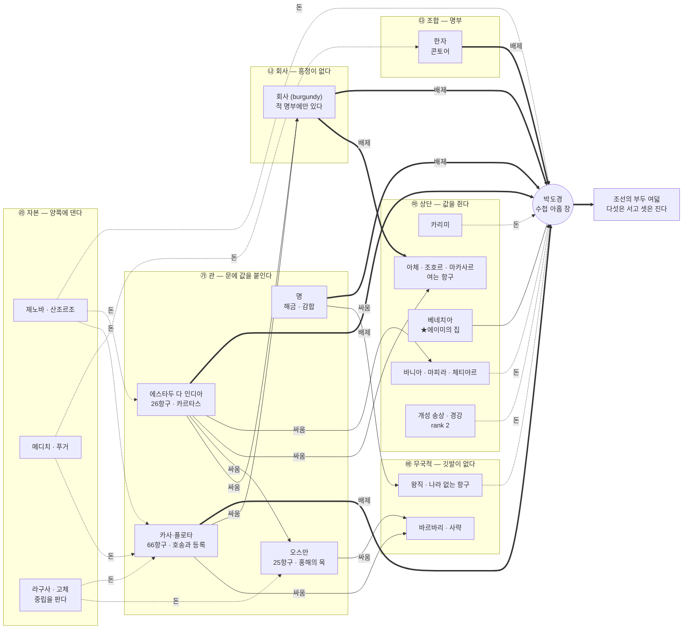

# 구해기 — 세력 (경쟁과 전쟁)

> **이 문서가 무엇인가.** 사용자가 명시적으로 요구한 것 —
> *"당연히 다른 상단, 제노바, 동인도 회사 등 그 당시 세력들과도 경쟁하고 때로는 전쟁해야겠지.
> 이것들도 소설 시놉·이벤트·관계도 등 만들어놔."*
> 그것을 [CHARACTERS.md](CHARACTERS.md)·[HEGEMONY.md](HEGEMONY.md)와 나란히 서는 문서로 정한 것이다.
>
> **원칙은 그대로 승계한다** — 연도를 고정하지 않는다 · 조선을 미화하지 않는다 ·
> 돈이 쉽게 벌리는 장면을 쓰지 않는다 · **게임 데이터를 바꾸지 않는다** ·
> **68장 체계를 늘리지 않는다**(부 경계 D 395 / 1,125 / 2,123 / 4,127 / 5,587 / 6,317).
>
> ⚠️ 이 문서는 설계다. `js/` 아래 어떤 파일도 고치지 않았다 — 아래 수치는 전부 **읽기만** 해서 얻었다(§8-2).

### 정본 관계

| 층 | 정본 | 이 문서의 태도 |
|---|---|---|
| **깃발·상단·적 명부·악명** | `js/regions/*/geo.js`·`npc-traders.js`·`npc-pirates.js` · `js/data.js: INFAMY`·`ENEMIES`·`HEGEMONY` | **코드가 정본이다.** 여기 적힌 값은 사본이고 어긋나면 코드를 믿는다 |
| **주제·아홉 바다 뼈대** | [SYNOPSIS.md](SYNOPSIS.md) §3 주제 · §4 아홉 바다 표 · §10 대립 구도 | **한 칸도 안 바꾼다.** 이 문서는 §4의 '위기'에 **얼굴을 얹을 뿐**이다 |
| **장 구성** | [OUTLINE.md](OUTLINE.md) 68장 | **한 장도 늘리지 않는다.** §5의 이벤트는 전부 **기존 장 안**이다 |
| **갈래 다섯** | [PROTAGONISTS.md](PROTAGONISTS.md) §0 원리 A·B·B-1·C · §3 분기표 | §4-2가 그 어법을 잇는다 |
| **두 번째 끝** | [HEGEMONY.md](HEGEMONY.md) | ★ **이 문서의 중심 판단이 그 문서에 직접 걸린다**(§1-3) |
| **인물** | [CHARACTERS.md](CHARACTERS.md) | 얼굴은 **거기 이미 있는 사람을 먼저** 쓴다(§3에서 ✔로 표시) |

---

## 1. ★ 중심 문제 — 이 소설에서 세력과의 싸움은 무엇인가

세력전은 이 소설의 주제와 **정면으로 부딪힐 수 있다.** [SYNOPSIS §3](SYNOPSIS.md)이 주제를
이렇게 못 박아 두었기 때문이다 — ***"제도를 부수지 않고 다시 쓰는 이야기."***
전쟁으로 이겨서 남의 자리를 빼앗는 것은 제도를 다시 쓰는 것이 아니라 **임자를 바꾸는 것**이고,
그러면 주인공은 28장에서 목이 잘리는 왕직과 구분되지 않는다.

그래서 이 문서는 답부터 낸다. 네 문장이고, 넷 다 게임 수치에 걸려 있다.

### 1-1. 전쟁은 고르는 것이 아니라 **당하는 것**이다

게임이 먼저 그렇게 말한다. `pickEnemy`는 **플레이어의 자산을 본다** — 가진 것이 많을수록 센 것이 온다.
곧 세력의 함대는 그가 도전했기 때문에 오는 것이 아니라 **그가 실을 것이 생겼기 때문에** 온다.
20장 「흑수구」가 이 소설의 첫 싸움인 근거도 정확히 그 반대편이다 —
그때 자산이 6,000 이하라 세기표가 **1~2만** 주고, 그것이 *게임이 승리를 허락하는 유일한 구간*이다
([GAME-LINK §6](GAME-LINK.md)).

★ 그러므로 이 소설에서 세력전의 방아쇠는 **주인공의 야심이 아니라 그의 화물목록**이다.
그가 산지에 손을 대는 순간(31장 반다의 정향 · 61장 우앙카벨리카의 수은 · 55장 라플라타의 은)
독점을 쥔 쪽이 먼저 온다. 그는 한 번도 먼저 치지 않는다.

### 1-2. 싸움의 값은 **이기는 것이 아니라 살아남아 계속 장사하는 것**이다

게임에 그 값을 재는 눈금이 이미 있다 — **악명**(`js/data.js: INFAMY` · `state.infamy[flag]`).

| 눈금 | 값 | 뜻 |
|---|---|---|
| 깃발 하나를 털면 | 악명 **+1** (`map.js:477` — 상대의 `flag`를 보고 붙는다) | 세력은 배가 아니라 **깃발 단위**로 기억한다 |
| 악명 1당 | 그 깃발 항구의 세 **+22%**(최대 2.6배) | 이겨도 **그 바다 전체에서 장사가 비싸진다** |
| 악명 1당 | 조우 확률 **+1.8%p**(상한 12%p) | 이겼기 때문에 다음에 더 온다 |
| 잊힘 | **40일마다 1** 감소 | 잊히기는 한다. 다만 **판이 한 번 접힌 뒤**에 |

★★ **이 상수 넷이 §1의 답 전체다.** 세력과의 싸움에서 이겨도 얻는 것은 전리품 한 번이고,
잃는 것은 **그 깃발이 가진 모든 항구에서의 세율과 안전**이다. 에스파냐 깃발은 항구가 **66곳**,
포르투갈이 **26곳**, 오스만이 **25곳**이다(§2-1). 스물여섯 항구에서 세가 두 배가 되는 대가로
카라크 한 척을 나포하는 것은 장사가 아니다 — 시마이 소시쓰가 이미 그 말을 했다.
***"싸움에 돈을 대는 건 장사가 아니오. 그건 그냥 태우는 거요."***

곧 **이 소설의 세력전은 전투 장면이 아니라 회계 장면이다.** 회피의 형태 다섯(도주 · 통행료 ·
항복 · 임검 통과 · 속임수 — [SYNOPSIS §10](SYNOPSIS.md))은 비겁이 아니라 **그 회계의 결과**다.

### 1-3. ★ 이겨서 그 자리를 차지하면 **그는 그 세력이 된다** — 게임이 그 문에 이름까지 붙여 두었다

이것이 이 문서의 가장 무거운 발견이다.

- 권역 패권 조건 ③은 **"그 바다 최상급 적(등급 5) 격파"**다(`data.js: HEGEMONY.bossTier: 5`).
- 그런데 **아홉 바다 중 여덟에서 그 등급 5가 해적이 아니라 나라·회사의 함대다**(§2-3 실측).
- 곧 게임에서 **"세력을 이긴다" = "패권"**이고, 패권은 [HEGEMONY.md](HEGEMONY.md)가 이미
  **왕직의 완결된 반사실**로 판정했다 — *"하나는 놓고 오는 이야기고, 하나는 붙들고 죽는 이야기다."*

★★ **그러므로 세력을 이기는 문은 이 소설에 이미 나 있고, 그 문의 이름이 「아홉 바다」다.
68장은 그 문 앞을 아홉 번 지나가면서 아홉 번 안 들어간다.**
[SYNOPSIS §7](SYNOPSIS.md)의 5부 도덕적 시험(*"왕직이 될 것인가 → 안 된다"*)이 곧 이 문의 손잡이다.

### 1-4. 그리고 **경쟁은 전쟁보다 압도적으로 많다** — 세력은 대포로 안 이긴다

세력이 주인공을 이기는 방법은 68장 안에서 **대포가 아니라 넷**이다. 넷 다 기존 장에 이미 있다.

| 무기 | 장 | 무슨 일 |
|---|---|---|
| **문서** | 36장 「같은 줄 번호」 | 카르타스가 있었는데 **같은 줄 번호를 먼저 지난 배가 먹었다.** 배 다섯이 하루 만에 없어진다 |
| **명부** | 52장 「명부에 없는 이름」 | 값을 다 내고도 정해진 부두 밖으로 못 나가 모직에 곰팡이가 앉는다. **세율이 아니라 자격** |
| **날짜** | 57장 「사흘 전에 떠난 함대」 | 함대는 사흘 전에 떠났고 다음은 다음 해 여름이다. 플로타는 무장이 아니라 **날짜의 제도**다 |
| **값** | 33장 「짐을 쪼갠다」 | 열두 척이 먼저 부려 값이 이미 무너져 있다. **상단끼리의 전쟁은 먼저 도착하는 것**이다 |

★ 이 넷이 이 소설의 세력전 본체다. 그리고 넷 중 어느 것도 **주인공이 이길 수 없고,
넷 다 그가 배워서 나중에 조선의 부두에 심는 것**이다(등록제·자유항·호송·보험).
***세력에게 지는 방식이 곧 수첩 아홉 장이다.***

### 1-5. 한 줄 결론

> **이 소설에서 세력과의 싸움은 "누가 그 바다를 갖느냐"가 아니라
> "그 바다에서 계속 배를 띄울 수 있느냐"의 싸움이다.
> 이기면 그 세력이 되고, 지면 배를 잃고, 살아남으면 한 줄을 적는다.
> 그는 아홉 번 세 번째를 고른다.**

---

## 2. 게임이 이미 정해 둔 것 — 실측 (다시 재지 않는다)

### 2-1. 깃발 스물여덟 — **세력은 곧 깃발이다**

`state.infamy`가 깃발 단위이므로, 이 소설의 "세력"은 상상이 아니라 **코드의 `flag` 값**이다.

| 깃발 | 항구 | 공업력 합 | 깃발 | 항구 | 공업력 합 |
|---|---:|---:|---|---:|---:|
| `spain` | **66** | 82 | `england` · `gujarat` | 각 6 | 11 · 11 |
| `portugal` | **26** | 33 | `vijayanagara` | 6 | 8 |
| `ottoman` | **25** | 27 | `france` · `hanse` · `benin` | 각 5 | 6 · 10 · 5 |
| `ming` | 13 | 26 | `venice` · `pirate` · `burgundy` · `kotte` | 각 4 | 6 · 4 · 8 · 4 |
| `majapahit` · `japan` | 각 12 | 21 · 19 | `hospitaller` · `denmark` · `safavid` · `zamorin` · `bengal` | 각 3 | 3 · 4 · 2 · 4 · 7 |
| `malacca` · `hafsid` · `swahili` · **`joseon`** | 각 9 | 13 · 11 · 11 · **9** | **`genoa`** | **2** | 4 |
| `oman` | 7 | 9 | `sweden` · `ryukyu` | 각 1 | 2 |

★ **`joseon`은 아홉 항구에 공업력 합 9다** — 항구 수로는 중위권인데 **평균이 정확히 1.00**이라
`pirate`(토르투가·쌍서·계롱·타요완)·`benin`·`kotte`와 같은 급이다. 명과 한자는 **2.00**,
에스파냐 1.24, 포르투갈 1.27이다. 조선을 미화하지 않는 자리가 여기다.
★ **`genoa`는 항구가 둘인데 상단이 넷이다**(§3-3). **자본은 항구를 안 가진다.**

### 2-2. 상단 예순여덟 — **세력의 몸**

`npc-traders.js` 아홉 파일에 **68개 상단**이 있다(아프리카 7 · 대서양 8 · 카리브 8 · 동아시아 8 ·
인도양 8 · 지중해 8 · 중동 6 · 동남아 7 · 남아메리카 8). 필드가 `rank 1~5`(규모) · `scope`
(`region`/`ocean`) · `circuit`(순회로) · `season`이라, **어느 세력이 어느 물길을 언제 도는지가
이미 데이터로 있다.** 소설이 지어낼 것이 없다.

★ **조선의 상단은 하나이고 `rank 2`다** — `songsang`(개성 송상 · 판옥선 · *"바다에 나오는 것은
부산포까지가 전부다"*). 68개 중 가장 작은 축이고, 그것이 이 소설의 1부 조건이다.

### 2-3. ★ 적 명부 — **여덟 바다의 최상급은 나라·회사이고, 조선의 바다만 무국적이다**

두 명부가 있다. 이름 있는 자들(`PIRATES` 40)과 이름 없는 등급 1~5(`FOES` 45 = 9권역 × 5).

**① 이름 없는 등급 5** (`FOES[4]` — 패권 조건 ③이 요구하는 바로 그 급 · `ENEMIES[4]`
수치 그대로 hp 360 · 포 30 · 병력 130)

| 권역 | 등급 5의 얼굴 | 깃발 |
|---|---|---|
| 인도양 | **포르투갈 인도 함대 기함** | `portugal` |
| 중동 | **포르투갈 인도 함대** | `portugal` |
| 카리브 · 대서양 | **스페인 은함대 호위기함** | `spain` |
| 남아메리카 | **서인도회사 함대** | `burgundy` |
| **동남아** | **회사 향료 함대** | `burgundy` |
| 아프리카 | **오스만 홍해 함대** | `ottoman` |
| 지중해 | 바르바리 기함 알 사파 | `ottoman` |
| **동아시아** | **왜구 대선단** | **`pirate`** |

**② 이름 있는 명부 40 — 그중 28(70%)이 나라·세력 깃발을 달고 있다.**
`pirate` 깃발은 12뿐이고, **그 12 중 4가 동아시아에 몰려 있다**(왕직 · 서해 · 림아퐁 · 삼도의 왜구).
권역별 최강자를 세면 여덟 바다는 깃발을 달았고 — 바르바로사(`ottoman`) · 드레이크(`england`) ·
쿤할리 마라카르(`zamorin`) · 크우말라하야티(`ottoman`) — **동아시아의 최강자 왕직만 깃발이 없다.**

★★ **두 명부가 같은 말을 한다: 조선의 바다에는 세력이 없고, 그래서 무국적자가 가장 세다.**
이것이 28장 「왕직의 목」의 문장(*"나라 없는 부는 하루아침에 없어진다. 배를 지키는 것은
대포가 아니라 깃발이다"*)이 게임 데이터에서 이미 참인 이유이고, 이 문서 전체의 출발점이다.
★ 게임의 `seasia/npc-pirates.js` 주석이 그 경계를 직접 적어 두었다 —
*"해적과 수군의 경계가 없는 바다다. 같은 사람들이 그대로 조호르의 수군이 되었다 —
바뀐 것은 그들을 부르는 이름뿐이다."*

### 2-4. 인물 일흔하나 — **세력의 얼굴이 이미 항구에 앉아 있다**

`npc-figures.js`의 71명 전원이 여덟 서비스 중 하나를 판다(문서 · 밀수 · 수리 · 대부 ·
일감 · 사람 · 시세 · 항로 → [GAME-LINK §5-1](GAME-LINK.md)). ★ **세력을 인물로 쓰라는 요구는
이미 게임이 절반 해 두었다** — 아래 §3의 얼굴 대부분이 이 71명 안에 있다.

---

## 3. 세력 명부 — 이 세계에서 어떤 얼굴인가

> ★ **어느 세력도 순수한 악이 아니다.** 이 소설은 관(官)과 밀무역 **둘 다** 답이 아니라고
> 말하는 이야기이므로, 각 세력에 **그들 나름의 논리**를 반드시 적었다. 악당이 없는 대신
> **아무도 물러설 이유가 없다**는 것이 이 세계가 무서운 이유다([SYNOPSIS §12](SYNOPSIS.md) —
> *"그들이 가진 것은 잔인함이 아니라 제도이고, 그것이 이 소설이 무서워하는 쪽이다"*).
>
> `✔` = [CHARACTERS.md](CHARACTERS.md)에 이미 있는 인물 · `☆` = 게임 `npc-figures.js`/`npc-traders.js`에 있는 인물

세력을 **무엇으로 이기는가**로 여섯 갈래에 나눈다 — **관(문서) · 회사(무력) · 조합(명부) ·
자본(돈) · 상단(값) · 무국적(없음).** 여섯 갈래가 곧 §4 관계도의 세로축이다.

---

### 갈래 ㉮ 관(官) — 문에 값을 붙이는 자들

#### 1. 에스타두 다 인디아 (포르투갈) — *종이 한 장으로 바다를 갖는 법*

| | |
|---|---|
| **몸** | 항구 26 · 상단 여섯(`casadaindia` 리스본 · `cochinfeitoria` 코친 · `casado` 고아 · `naudotrato` 마카오 · `sofalafeitoria` 소팔라 · `casadamina` 엘미나) · 등급 5 함대 **둘**(인도양·중동) |
| **지키려는 것** | **정복이 아니라 세입이다.** 인도양의 모든 배가 카르타스를 사면 함대를 띄울 필요가 없다. 배 서른 척으로 바다 하나를 갖는 유일한 방법이고, **그들은 배가 서른 척뿐이다.** 그것이 이 세력의 논리이자 약점이다 |
| **얼굴 ①** | ☆**고아 세관의 카르타스 서기**(`ind-goa-cartaz`) — *"이 바다는 국왕의 것이오."* 그는 나쁜 사람이 아니라 **한 장에 150~400닢을 받고 영수증을 끊는 사람**이다 ✔ |
| **얼굴 ②** | ✔**카피탕-모르 두아르트** — 마카오·나가사키 정기선의 선장. *"악인이 아니라 **먼저 온 사람**이다. 그의 무기는 배가 아니라 왕의 문서"* |
| **처음 만나는 자리** | **16장 「카피탕-모르」**(동아시아 · 마카오). 배가 더 크고 빠른 것은 문제가 아니다 — **그에게는 왕의 문서가 있고 도경에게는 없다.** 그것이 이 소설이 세력을 정의하는 방식이다 |
| **약점** | 40장에서 그 논리가 뒤집힌다 — *문을 가진 자도 문을 너무 좁히면 배가 다른 목으로 간다* |

#### 2. 카사 데 콘트라타시온 · 플로타 (에스파냐) — *부는 호송되어야 도착한다*

| | |
|---|---|
| **몸** | 항구 **66**(세계 최대) · 상단 여덟(`flota` 서인도 함대 · `feriaportobelo` · `galeondemanila` · `plataflota` 남해 은 수송선 · `azogueros` 수은 운반대 등) · 등급 5 함대 둘(카리브·대서양) · 등급 4 **과르다코스타 순찰선** |
| **지키려는 것** | **은은 혼자 못 간다.** 낱배로 보내면 털리고, 떼로 보내면 늦다. 그들이 파는 것은 안전이고 그 값이 아베리아(호송세)와 **한 해의 대기**다. 등록(registro)은 통제가 아니라 **명단**이다 — 명단에 없는 배는 지켜 줄 수 없다 |
| **얼굴 ①** | ✔☆**카야오의 등록관**(`sam-callao-registro`) — *"같은 자리에 두 번 앉는다. 한 번은 속이려고, 한 번은 등록하려고."* 이 소설에서 **세력의 문 안으로 주인공이 실제로 걸어 들어가는 유일한 자리** |
| **얼굴 ②** | ☆**아바나 함대 집결소의 진두관**(`car-havana-flota`) · ☆**카사 데 콘트라타시온의 수석 도선사**(`atl-piloto-mayor`) — 뒤엣사람이 6부 부산포에 심기는 한 장을 준다 |
| **처음 만나는 자리** | **23장 「마닐라의 두 척」**. 갈레온은 왕이 정한 두 척뿐이라는 것을 오이도르의 입으로 듣는다. 도경: *"그럼 세 번째 배는 누가 정하오?"* |
| **약점** | 60장 — 아바나 7.5% + 아베리아 + 한 해 대기 ↔ 퀴라소 1.5% + 밤배. **계산해 보니 뒤가 네 배다.** 안전에 값을 너무 붙이면 안전을 안 사고 만다 |

#### 3. 명(明) — 해금과 감합 *(관의 동양판)*

| | |
|---|---|
| **몸** | 항구 13 · 공업력 합 26(**항구당 2.0 — 세계 최고**) · 상단 셋(`zhengfujian` 월항 정씨 · `patanilin` 파타니 임씨 등) · 등급 4 **명 수군 순찰선** |
| **지키려는 것** | **바다가 아니라 뭍이다.** 해금은 무역을 막는 법이 아니라 **연안을 지키는 법**으로 만들어졌고, 그래서 이 세력은 자기가 무엇을 막고 있는지 모른다. 감합은 통과가 아니라 **순서**를 판다 |
| **얼굴** | ✔☆**시박태감 뇌은**(`eas-ningbo-kanhe`) — *"순서는 규칙이 아니라 내 재량이오."* ★뒷돈 받는 관리를 **겁먹은 사람**으로 그린다 · ✔☆**월항 인표 중개인** · ✔☆**광저우 아행**(*"법도 아니고 관습이오 — 그래서 더 안 되오"*) |
| **처음 만나는 자리** | **17장 「월항, 남의 이름」** → **18장 「순서를 사는 값」**(닝보). 도경이 뒷돈을 주고 **부끄러워하지 않는** 장이고, 여기서 그는 확실히 아버지와 다른 사람이 된다 |
| **★ 데이터가 말하는 것** | 이 권역만 **등급 4가 관(명 수군)이고 등급 5가 왜구**다. **집의 바다에서만 관이 해적보다 약하다** — 24장 쌍서 소탕은 그 관이 한 번 이기는 밤이고, 28장 왕직의 목은 그 승리가 무엇을 없앴는지 세는 장이다 |

#### 4. 오스만 — 세가 가장 무거운 바다

| | |
|---|---|
| **몸** | 항구 25 · 상단 넷(`karimi` · `bafaqih` · `benveniste` · `arabicaravan`) · 등급 5 **오스만 홍해 함대**(아프리카) · 명부 최강 여섯이 이 깃발 |
| **지키려는 것** | **목**이다. 홍해와 페르시아만이 유럽과 인도 사이의 유일한 짧은 길이고, 그 목을 쥔 값이 세다. 그리고 그들은 그 세로 **예니체리의 옷을 입힌다**(`benveniste` — 세파라드가 살로니카에 놓은 베틀). 세입이 곧 군대다 |
| **얼굴** | ✔☆**아덴 세관의 관리**(`mid-aden-furda`) — 세를 낼 때까지 **돛과 키와 닻을 떼어 창고에 넣는다.** 그는 배를 부수지 않는다. **세운다** · ☆**지다 세관의 아미르**(`mid-jeddah-amir`) |
| **처음 만나는 자리** | **39장 「떼어 간 돛과 키」**(아덴). 짐을 팔아야 세를 내는데 배가 안 움직이는 **닫힌 고리** |
| **약점** | **40장 「마흔한 번째 배」** — 세가 오르자 정박선들이 밤사이 지다로 올라간다. 세관 노인이 마흔 척의 목록을 보여 준다. ★이 소설에서 주인공이 **세력끼리의 경쟁을 처음으로 자기 이득으로 읽는** 자리 |

---

### 갈래 ㉯ 회사 — 흥정할 수 없는 유일한 상대

#### 5. **회사** (동인도·서인도) — *값을 지키는 방법이 나무를 베는 것*

> ★ **사용자가 지목한 "동인도 회사"의 자리.** 게임에서 이 세력은 **상단 명부에 거의 없고
> 적 명부에만 있다.** 그것이 이 소설의 답이기도 하다.

| | |
|---|---|
| **몸** | 깃발 `burgundy`(항구 4 — 브뤼헤 · 안트베르펜 · **암스테르담** · **퀴라소**). ★게임 주석이 이유를 적어 두었다: *"이 게임에 네덜란드 공화국 깃발이 없고 암스테르담·안트베르펜·브뤼헤가 이미 `burgundy`를 달고 있다"*(`caribbean/geo.js`) |
| **이빨** | **동남아 등급 5 「회사 향료 함대」 · 등급 4 「회사 순찰선」 · 남아메리카 등급 5 「서인도회사 함대」 · 아프리카 등급 4 「네덜란드 사략 선단」 · 대서양 등급 2 「젤란트 사략선」** · 명부에 얀 야콥선(세기 4) · 아라야의 소금선단(2) · 세니의 우스코크(2) |
| **★ 무역 상대로는 하나뿐** | 68개 상단 중 `burgundy`는 `rescate`(리오아차의 구조무역선 · rank 2) 하나다 — *"'난파선을 구했다'는 명목으로 외국 배와 거래한다. 총독도 옷감이 필요하다."* **그들과 정상적으로 거래할 자리가 세계에 없다** |
| **지키려는 것** | **값 자체다.** 다른 세력은 문에 값을 붙이지만 이들은 **값이 떨어지는 것을 물리적으로 막는다.** 그들 나름의 논리도 분명하다 — 향료가 흔해지면 회사가 망하고, 회사가 망하면 그 배에 돈을 댄 수천 명이 망한다. **주주가 있는 최초의 세력**이고, 그래서 사람의 자비가 들어갈 자리가 없다 |
| **얼굴** | ✔☆**암본 향료 창고의 감시관**(`sea-ambon-warden`) — *"향료는 우리 창고에만 부려라."* 값을 트려 하자 **나무가 베인다** |
| **처음 만나는 자리** | **31장 「쌀 한 되, 정향 한 근」**(반다 · 암본 · 세 9% + 창고값). 값을 지키는 방법이 파는 것을 줄이는 것이 아니라 **자라는 것을 없애는 것**이라는 데서 도경이 **처음 무서워한다** |
| **★ 이 세력만 다른 점** | 다른 세력은 전부 **살 수 있다.** 명은 순서를 팔고, 포르투갈은 종이를 팔고, 오스만은 세를 받고, 한자는 한 철 자격을 판다. **회사만 아무것도 안 판다** — 그들이 파는 것은 정향이고, 정향은 이미 그들 것이다. 도경의 무기 셋(말·셈·담의 위치)이 **전부 안 통하는 유일한 세력**이고, 그래서 그가 반다에서 얻는 것은 이득이 아니라 **공포**다 |
| **⚠️ 연표** | **알고 그렇게 두었다** → §7-1 |

---

### 갈래 ㉰ 조합 — 명부에 안 올려 주는 자들

#### 6. 한자 (뤼베크 총회) — *세율이 아니라 자격*

| | |
|---|---|
| **몸** | 항구 5(함부르크 · **뤼베크** · **단치히** · 리가 · 레발) · 상단 셋(`bergenfahrer` · `ferber` · `novgorodfahrer` — **셋 다 계절 상단**이다) |
| **지키려는 것** | **회원이 물어 주는 손실**이다. 한자는 나라가 아니라 **보증 조합**이라, 아무나 끼워 주면 아무도 안 물어 준다. 명부는 배제 장치이기 전에 **책임 장치**다. 그 논리가 정당한 만큼 밖에서는 벽이 된다 |
| **얼굴** | ☆**뤼베크 총회의 길드장**(`atl-lubeck-guild`) · ☆**스틸야드의 상관장**(`atl-steelyard`) · ☆**페터호프의 통역**(`atl-peterhof-tolk`) |
| **처음 만나는 자리** | **52장 「명부에 없는 이름」**. 런던 스틸야드의 모직 대량 주문 — 조건은 *"실어 갈 곳은 한자가 정한다"*. 뤼베크에서 **520닢짜리 한 철 손님 자격**을 사고도 정해진 부두 밖으로 못 나가 **모직에 곰팡이가 앉는다** |
| **★ 이 소설에서의 무게** | ***여기가 왜관의 담이다.*** 값을 깎아 주지 않는 것이 아니라 **명부에 안 올려 주는 것** — 1부 2장의 담이 지구 반대편에서 같은 모양으로 서 있다. 그리고 그 도시들이 시든다 |

#### 7. 아행 · 샤반다르 · 판카다 — *중개를 독점하는 자리들* (조합의 동양판)

| | |
|---|---|
| **몸** | ☆광저우 아행(`eas-guangzhou-hang`) · ☆믈라카의 샤반다르(`sea-melaka-shahbandar`) · ☆나가사키 판카다 중개인(`eas-nagasaki-pancada`) · 상단 `syahbandar`(반텐 — *"세를 매기는 사람이 곧 제일 큰 상인이다"*) |
| **지키려는 것** | **말이 통하는 것 자체**다. 낯선 배가 낯선 값을 부르면 시장이 안 선다. 중개는 사기가 아니라 **번역**이고, 다만 그 번역료가 독점이다 |
| **처음 만나는 자리** | **29장 「샤반다르의 소개장」**(믈라카). ***"이 배를 다시 지어 줄 부두가 이 바다에 없소."*** 조선 배는 이 바다에서 **수리는 되고 재생산은 안 된다** |

---

### 갈래 ㉱ 자본 — 양쪽에 대는 자들 *(사용자 지목: 제노바)*

#### 8. **제노바** — 산조르조와 가문들

| | |
|---|---|
| **몸** | **항구 둘**(제노바 · 키오스)인데 **상단 넷**(`spinola` 명반 rank 5 · `grimaldi` 곡물 rank 4 · `medici` 갤리 rank 5 · `gozze` 라구사 선주조합 rank 4). ★ 게임 주석: *"베네치아가 국가라면 **제노바는 가문이다.** 노선도 국가가 아니라 집안이 정했고, 그래서 이쪽은 지중해를 벗어나 대양으로 나간다"* |
| **지키려는 것** | **어느 편도 안 드는 것.** 편을 들면 반대편 항구가 닫히고, 항구가 닫히면 어음이 안 돌아온다. 그들에게 중립은 도덕이 아니라 **재고 관리**다 |
| **얼굴 ①** | ☆**산조르조의 전주**(`med-sangiorgio` · 서비스 `loan`) — **해상대차**를 판다. *배가 가라앉으면 원금을 안 갚는 돈.* 위험을 파는 첫 얼굴 |
| **얼굴 ②** | ☆**스피놀라 명반선** — 명반광을 통째로 쥔 집안. 그 방어선이 대사로 되어 있다: ***"산 조르조 은행이 이 배를 보증했소. 털면 제노바 전체와 싸우는 것이오."*** |
| **처음 만나는 자리** | **49장 「쪼개어 파는 법」**. 제노바 산조르조의 해상대차로 밑천을 만들고 몰타 경매에서 나포된 샤벡을 3,000닢에 산다. ★**이 소설에서 자본이 처음으로 그의 편이 되는 자리**이고, 조건은 우정이 아니라 **이자**다 |
| **★ 양쪽에 댄다** | 아드리아의 우스코크에게 재기 밑천 절반이 날아가는데 **망하지 않는다** — 화물을 배 셋에, **인수업자 넷에** 나눠 두었기 때문이다. 그 넷이 서로 다른 깃발 편이라는 것을 도경은 나중에 안다. *위험을 쪼개어 판다는 것은 곧 **적에게도 판다는 뜻**이다* |

#### 9. 메디치 · 푸거 — 어음을 싣는 배

| | |
|---|---|
| **몸** | `medici`(피렌체 은행의 갤리 · rank 5 · 밑천 9,000~24,000 — 지중해 최대) · `fugger`(푸거 상관 안트베르펜 지점 · `burgundy` · rank 5 · *"황제에게 돈을 꿔 준 집"*) |
| **지키려는 것** | **왕이 지면 그들이 진다.** 왕실에 돈을 꿔 준 자는 그 왕실이 이기기를 바라는 동시에, 그 왕실이 **한쪽만** 이기지 않기를 바란다. 세력 하나가 다 먹으면 다음 대출의 이자가 떨어지기 때문이다. **자본이 양쪽에 대는 이유가 인색이 아니라 산술**이라는 것 |
| **얼굴** | ☆메디치 상관의 갤리 — *"현금이 없어도 좋소. 지불 약속만 확실하면."* 그리고 방어선: ***"우리를 털면 로마와 리옹과 브뤼헤가 동시에 당신 이름을 적소."*** |
| **처음 만나는 자리** | **53장 「법이 닫히는 날」**(안트베르펜 · 암스테르담). 그 도시가 4%로 문을 열어 배가 몰려 있는 것을 본 자리 |

#### 10. 라구사 — 중립을 파는 공화국

| | |
|---|---|
| **몸** | `gozze` 고체 선주 조합(깃발은 `genoa`를 빌린다 → §7-2) · 라구사는 `ottoman` 항구이고 **공업력 3** |
| **지키려는 것** | **아무하고도 안 싸우는 것.** 오스만에 조공을 바치고 중립을 사서, 전쟁 중에도 이 배들만은 양쪽 항구에 다 들어갔다. *"어느 편도 들지 않아 모든 항구에 들어가는 배. 그 중립이 이 집의 재산이다."* |
| **얼굴** | ☆**라구사의 해상보험 공증인**(`med-ragusa-notary`) — 요율표·공증·국적 위임장 |
| **처음 만나는 자리** | **49장**. 여기서 도경은 `Paolo Coreano`가 된다 — **이름 다섯 번째 칸.** ★조선인이 세력 하나의 국적을 **사서** 입는 유일한 자리이고, 그 값이 이름이다 |
| **★ 왜 중요한가** | **라구사는 이 소설에서 조선이 될 수 있었던 것의 모형이다.** 작고, 배후지가 없고, 큰 나라 사이에 끼어 있는데 **부두 하나로 산다.** 6부 계산서(65장)에 이 도시가 근거로 들어간다 |

---

### 갈래 ㉲ 상단 — 배를 안 타고 값을 쥔 자들 *(사용자 지목: "다른 상단")*

#### 11. 카리미 상단 (홍해) — *값을 정하는 것이 시장이 아니라 이들이다*

| | |
|---|---|
| **몸** | `karimi`(rank **5** · 밑천 중동 최대) — *"홍해의 향신료를 통째로 쥐었던 대상단"* |
| **지키려는 것** | **한 물건의 전 구간**이다. 산지에서 알렉산드리아까지 한 집안이 끌고 가면 중간에 값이 안 샌다. 그것이 독점이지만, 동시에 그 구간의 **누구도 굶지 않게 하는 방식**이기도 했다 |
| **얼굴** | ✔☆**카리미의 전주**(`mid-karimi-financier` · `loan`) — **이름을 안 적는 조건**으로 밑천을 댄다 |
| **처음 만나는 자리** | **41장 「이름을 안 적는 조건」**(카이로 · 3부 결말). ★**다른 상단이 처음으로 그를 살리는 자리**이고, 값은 **익명**이다. *익명은 방패이고, 방패에는 값이 있다* |

#### 12. 바니아 · 마피라 · 체티야르 (인도양) — *배를 안 가지고 값을 가진다*

| | |
|---|---|
| **몸** | `bania`(캄바트 · rank 4 · *"배를 타지 않고 배를 부리는 사람들. 이 해안의 값은 이 집 장부에서 정해진다"*) · `mappila`(마피라 선주단 · rank 4 · *"포르투갈이 가장 미워한 배"*) · `chettiar`(rank 3 · *"남의 항해에 돈을 대는 사람들. 배가 작은 것은 배로 벌지 않기 때문"*) · `khoja` · `portogrande` |
| **지키려는 것** | **계절풍이다.** 이 바다에서 시간은 균질하지 않아 늦으면 반년이 없어진다. 그래서 그들의 이자는 달이 아니라 **철(季)로** 센다 |
| **얼굴** | ☆**캄바트의 바니아 전주**(`ind-cambay-bania`) — 이자를 계절풍으로 센다 · ✔**아흐마드 이븐 마지드**(`mid-ibn-majid`) — *"바다는 길이 아니라 철이다"* |
| **처음 만나는 자리** | **35장 「국왕의 바다」**. 카르타스 서기 바로 옆에 이 전주가 앉아 있는 것이 이 장의 구조다 — **한 항구에 관과 상단이 나란히** 있고, 도경은 둘 다에게 돈을 낸다 |
| **★ 이 소설에서의 무게** | ***도경이 결국 되는 것이 이쪽이다.*** 그는 배로 이기지 않고 값으로 이긴다. 6부에서 그가 조정에 내는 것도 함대가 아니라 **계산서**다 |

#### 13. 베네치아 — 오래된 길

| | |
|---|---|
| **몸** | 항구 4(베네치아 · 칸디아 · 파마구스타 · 노브고로드) · 상단 둘(`contarini` 리알토 상관 · `cornaro` 키프로스 설탕) |
| **지키려는 것** | **자기가 판 길**이다. 향신료가 홍해를 거쳐 알렉산드리아로 오는 길에 이 도시가 서 있었고, 포르투갈이 희망봉을 돌면서 그 길이 통째로 옆으로 비켰다. 이 세력은 **이기려는 것이 아니라 안 지려고** 버틴다 |
| **얼굴** | ☆**리알토의 소식팔이**(`med-rialto-tipster`) — 값을 파는 것이 아니라 **소식**을 판다 |
| **★ 처음 만나는 자리 — 1장** | ★★**이 소설에서 주인공이 가장 먼저 만나는 세력이 베네치아이고, 그것이 난파해서 온다.** 에이미는 `OFFICER` 설정 그대로 **베네치아 리알토 상관의 서기**다(`js/data.js`). 세력 하나가 절영도 갯바위에 얹혀 있고, 부두 사람들이 그 널을 뜯어 간다 — **이 소설의 세력 서사가 시작하는 그림이 이것**이고, 68장에서 같은 손이 널을 짓는다 |
| **★ 규약** | 에이미는 **다섯 판본 전부에서** 4부 리스본에 닿고 남는다([PROTAGONISTS §3-2 제7해](PROTAGONISTS.md)). 그러므로 **베네치아는 다섯 갈래 누구에게도 편을 안 든다** — 세력 중 유일하게 주인공의 안쪽에 있고, 유일하게 떠난다 |

#### 14. 아체 · 조호르 · 마카사르 — *여는 항구, 그리고 지킬 나라*

| | |
|---|---|
| **몸** | 깃발 `malacca` 9항구 · `majapahit` 12항구 · 상단 `naina`(나이나 차투 · *"주인이 바뀌어도 부두에 남은 사람"*) · `acehpepper`(*"이스탄불에서 대포를 얻어 온 술탄의 배. 그 대포 값이 후추였다"*) · `bugis`(부기스 자유상인) · `orangkaya`(반다의 오랑 카야) |
| **지키려는 것** | **제 항구가 남의 항구가 되지 않는 것.** 마카사르의 왕이 말한다 — *"누구든 이 도시에서 장사할 권리가 있다."* 세 3%에 독점이 없다. **이 세계에서 가장 옳은 세력이고, 그래서 진다** |
| **얼굴** | ✔☆**마카사르의 항무관**(`sea-makassar-syahbandar`) — 이름 세 번째 칸 **`Cauqim`**을 적는 손 · **크우말라하야티**(게임 `malahayati` · **세기 5** — 이 바다 최강) |
| **처음 만나는 자리** | **30장 「세를 깎는 항구」**(마카사르 · 조호르 · 부톤) → 33장 아체에서 크우말라하야티를 스친다 |
| **★ 이 소설에서의 무게** | 수첩 제2해의 **뒷문장이 이 세력의 묘비다** — ***"여는 항구가 이긴다. 다만 지킬 나라가 없으면 언젠가 진다."*** 왕직의 목(28장)과 마카사르의 3%가 나란히 놓이는 것이 그 문장의 두 근거이고, **6부에서 내이포 자유항이 거부당하는 자리의 반대편 끝**이다 |

#### 15. 개성 송상 — 조선이 가진 유일한 상단

| | |
|---|---|
| **몸** | `songsang`(rank **2** · 판옥선 · `scope: region`) — *"전국에 송방을 깐 뭍의 상인들. **바다에 나오는 것은 부산포까지가 전부다.**"* |
| **지키려는 것** | **뭍의 길**이다. 그들은 바다를 몰라서 안 나가는 것이 아니라, **뭍에서 이미 이기고 있어서** 안 나간다. 나갈 이유가 없다는 것이 이 세력의 논리이자 이 소설의 문제다 |
| **처음 만나는 자리** | **6장 「첫 항차 — 마포」**. ✔경강상인 여씨가 조운 빈자리를 판다 — 도경의 첫 밑천이 여기서 나온다 |
| **★ 미화하지 않는 자리** | 68개 상단 중 조선 것은 **하나이고 rank 2다.** 세계에서 가장 큰 상단(`casadaindia` · `flota` · `karimi` · `spinola` · `medici`)이 rank 5이고 밑천이 그의 스무 배다. **이 격차가 1부의 실제 조건**이고, 68장에 가서도 조선이 rank 5를 갖지는 않는다 — 얻는 것은 **부두 하나와 배 한 척**뿐이다 |
| **갈래 연결** | [PROTAGONISTS §7](PROTAGONISTS.md) — 개성은 이 게임에 항구가 없으므로 송상은 **인물이 아니라 자금줄**로만 등장한다(Ⅳ 여상길의 송방) |

---

### 갈래 ㉳ 무국적 — 깃발이 없는 자들

#### 16. 왕직과 나라 없는 항구

| | |
|---|---|
| **몸** | 깃발 `pirate` 항구 **4**(토르투가 · 쌍서 · 계롱 · 타요완) · 명부 12(그중 **4가 동아시아**) · 왕직 **세기 5**(히라도) |
| **지키려는 것** | **문 없는 항구**다. 그들의 논리는 비뚤어진 것이 아니라 **너무 단순한 것**이다 — 파는 사람과 사는 사람이 있는데 왜 문이 필요한가. 그 물음에 이 소설은 대답하지 않고 **값을 보여 준다** |
| **얼굴** | ✔**왕직** — *나라 없는 항구의 왕. 도경이 될 뻔한 사람.* **28장에서 참수된다** · ✔**정지룡**(`flag: 'ming'`) — 해적이면서 **관의 깃발을 받아 낸 자**. 27장 「세 번째 답」 |
| **처음 만나는 자리** | **21장 「계롱」**. 나포선을 뜯어 판다. 돈이 된다. **그리고 아무도 지켜 주지 않는다** — 옆 창고가 하룻밤에 통째로 없어진다 |
| **★ 세력인가** | **그렇다. 그리고 그것이 이 소설의 논점이다.** 밀무역은 관의 반대가 아니라 **관의 그림자**이고, [SYNOPSIS §3](SYNOPSIS.md)이 *"답은 둘밖에 안 나와 있다"*고 할 때의 두 번째다. 이 세력이 무너지는 자리(24장 쌍서 · 28장 왕직의 목)가 곧 **세 번째 답이 필요해지는 자리**다 |
| **★ 두 번째 끝** | 이 세력이 **안 무너졌을 경우**가 [HEGEMONY.md](HEGEMONY.md)의 「아홉 바다」다 — 265항구 · 912,630닢 · 30일마다 4,563닢. *"죽음과 파산은 이 소설에서 같은 실패의 두 얼굴이다"* |

#### 17. 바르바리 코르세어 — 몸값을 파는 자들

| | |
|---|---|
| **몸** | 깃발 `hafsid` 9 · 명부 최상급(바르바로사 **세기 5** · 오루치 4 · 투르구트 3 · 알제 근거) · 반대편에 `hospitaller` 3항구(로도스 · 몰타 · 안코나)와 콘트레라스(세기 3) |
| **지키려는 것** | **성전(聖戰)과 사업이 같은 말인 상태.** 양쪽 다 그렇다 — 기사단도 나포하고 몸값을 받는다. 이 소설이 **한쪽만 해적이라고 부르지 않는 이유**가 데이터에 이미 있다 |
| **얼굴** | ✔**투르구트 레이스** — 46장에서 도경을 잡는다. 짐이 값이 안 나가자 **사람을 센다** |
| **처음 만나는 자리** | **46장 「사람을 세는 밤」**. 1부의 *"사람은 값이 안 나간다"*가 여기서 뒤집힌다 |
| **★ 반대편** | 이 세력에 대응하는 것이 **제도**다 — ☆**몸값을 치르는 삼위일체회 수사**(`med-tunis-redeemer`)와 48장 「영수증」. **칼이 아니라 종이가 사람을 꺼낸다.** 세력 하나가 사람을 값으로 만들면, 다른 제도 하나가 그 값을 나눠 낸다 |

#### 18. 사략(私掠) — 세력이 보낸 해적

| | |
|---|---|
| **몸** | 명부에 국가 깃발을 단 자가 **28/40**이다. 드레이크(`england` 세기 5) · 호킨스(`england` 4) · 캐번디시(`england` 4) · 자크 드 소르(`france` 4) · 장 플뢰리(`france` 3) · 얀 야콥선(`burgundy` 4) · **고아의 임검 함대**(`portugal` 3) |
| **지키려는 것** | **아무것도.** 그들은 지키는 쪽이 아니라 **남의 제도가 비싼 만큼 이문이 생기는 쪽**이다. 사략은 제도의 부작용이 아니라 **제도의 다른 얼굴**이고, 그래서 면허장 한 장으로 해적과 수군이 갈린다 |
| **처음 만나는 자리** | **58장 「겨울의 드레이크」**. 함대는 사흘 전에 떠났고, 남은 배를 노리는 자가 그 겨울에 온다. **이길 수 없다는 것을 즉시 알고 짐을 버리고 얕은 물로 든다** |
| **★ 소설의 규칙** | 이 부류는 **주인공이 상대하는 것이 아니라 그를 스치는 날씨다.** 이겨서 얻을 것이 없고(악명은 그 나라 깃발에 붙는다), 져서 잃을 것만 있다 |

---

## 4. 관계도 — 세력끼리는 어떻게 얽혀 있는가

> 축이 셋이다 — **누가 누구와 싸우는가 · 누가 누구에게 돈을 대는가 · 누가 누구를 배제하는가.**
> 셋을 한 그림에 겹치는 것이 이 절의 목적이다. **싸움 축만 보면 이 세계가 전쟁으로 보이고,
> 돈 축을 겹치면 그 전쟁의 양쪽에 같은 은행이 앉아 있는 것이 보인다.**

### 4-1. 세 축 한 표

| 축 | 누가 → 누구 | 무슨 일 | 게임 근거 | 장 |
|---|---|---|---|---|
| **싸움** | 에스타두 ↔ **회사** | 향료제도의 임자가 갈린다 | 동남아 등급 4·5가 둘 다 `burgundy` · 암본은 `portugal` 항구다 | 31 |
| **싸움** | 에스타두 ↔ 자모린 · 마피라 | 후추를 홍해로 직접 올려 보내는 배 | `mappila` *"포르투갈이 가장 미워한 배"* · 쿤할리 마라카르 세기 5 | 37 |
| **싸움** | 에스타두 ↔ 오스만 | 홍해의 목 | 아프리카 등급 5 **오스만 홍해 함대** · 미르 알리 베이(3) · 셀만 레이스(4) | 39·40 |
| **싸움** | 에스파냐 ↔ 잉글랜드·프랑스 사략 | 은함대를 노린다 | 드레이크 5 · 호킨스 4 · 캐번디시 4 · 자크 드 소르 4 | 58·62 |
| **싸움** | 에스파냐 ↔ **회사** | 소금과 카리브의 문 | 퀴라소(`burgundy`) · 아라야의 소금선단 · 남미 등급 5 서인도회사 함대 | 60 |
| **싸움** | 명 ↔ 왕직·왜구 | 쌍서 소탕 · 참수 | 명 수군 순찰선(등급 4) ↔ 왕직 5 · 서해 4 | 24·28 |
| **싸움** | 바르바리 ↔ 기사단 | 서로 나포하고 서로 몸값을 받는다 | `hafsid` ↔ `hospitaller`(로도스·몰타·안코나) | 46·49 |
| **싸움** | 아체 ↔ 에스타두 | 해협의 가장 좁은 곳 | 아체~믈라카 요율 **9.5**(권역 최고) · 크우말라하야티 5 | 33 |
| **돈** | **제노바 → 에스파냐 왕실** | 은함대를 담보로 왕에게 꿔 준다 | `spinola` scope `ocean` · 순회로에 **리스본**이 있다 · `med-sangiorgio` `loan` | 49·(57) |
| **돈** | **푸거 → 황제** | *"황제에게 돈을 꿔 준 집"* | `fugger` rank 5 · 안트베르펜 | 53 |
| **돈** | **메디치 → 아무나** | *"현금이 없어도 좋소. 지불 약속만 확실하면"* | `medici` 밑천 9,000~24,000(지중해 최대) | 49 |
| **돈** | 카리미 → **이름 없는 자** | 이름을 안 적는 조건으로 댄다 | `mid-karimi-financier` `loan` | 41 |
| **돈** | 체티야르 · 바니아 → 남의 항해 | *"배가 작은 것은 배로 벌지 않기 때문"* | `chettiar` rank 3 · `ind-cambay-bania` `loan` | 35 |
| **돈** | 송방 → 경강(Ⅳ) | 조선 안에서만 도는 신용 | `songsang` `scope: region` | 6 |
| **배제** | 한자 → 외지 상인 전부 | 콘토어 밖으로 못 나간다 | `atl-lubeck-guild` · `atl-steelyard` | **52** |
| **배제** | 명 → 바다 전부 | 해금 · 감합은 순서를 판다 | `eas-ningbo-kanhe` · `eas-yuegang-license` | 17·18 |
| **배제** | 에스파냐 → 비등록 배 | 등록(registro) 없는 배는 명단에 없다 | `sam-callao-registro` · `car-havana-flota` | 60·62 |
| **배제** | **회사 → 값 자체** | *"향료는 우리 창고에만 부려라"* — 그리고 나무를 벤다 | `sea-ambon-warden` | **31** |
| **배제** | 에스타두 → 카르타스 없는 배 | 없으면 나포다 | `ind-goa-cartaz` · 고아의 임검 함대 | **36** |
| **배제** | 조선(왜관) → 왜인 · 그리고 제 백성 | 담 안에서만, 삼포는 셋에서 둘로 | `eas-waegwan-tongsa` | 2 |
| **중립** | 라구사 · 고체 → 양쪽 다 | *"술탄에게도 교황에게도 값은 같소"* | `gozze` scope `ocean` | 49 |

### 4-2. 그림

★ **읽는 법 세 줄.**
① **실선(싸움)은 전부 세력끼리다** — 주인공에게로 오는 실선이 하나도 없다.
② **점선(돈)은 국경을 안 본다** — 제노바 하나가 에스파냐와 에스타두와 도경에게 동시에 댄다.
③ **굵은 선(배제)만 주인공에게 온다** — 이 소설에서 세력이 그를 대하는 방식은 공격이 아니라 **제외**다.

### 4-3. ★ 갈래 다섯이 어느 세력과 가까워지기 쉬운가

> [PROTAGONISTS §3](PROTAGONISTS.md) 분기표의 어법을 잇는다 —
> **종친은 제도를, 재상가의 서자는 자본을, 상인은 시장을, 군관은 배를,
> 역관의 서자는 그 전부를 적은 수첩을 낸다.**

| 갈래 | 가장 가까운 세력 | 왜 (게임 규칙) | 가장 안 통하는 세력 | 왜 |
|---|---|---|---|---|
| **Ⅰ 말** (역관의 서자) | **어느 세력도 아니다 — 문지기들** | 담의 위치를 아는 자는 세력이 아니라 **그 세력의 문 앞 사람**과 친해진다. `tariffOff 0.10`이 `joseonOnly`라 조선을 나서면 맨손이고, 그래서 71명 전부와 값을 흥정하며 다닌다 | **회사** | **회사에는 문지기가 없다.** 창고령을 내리는 사람은 흥정을 안 한다. 그의 무기 셋이 전부 안 통하는 유일한 세력(§3-5) |
| **Ⅱ 인맥** (재상가의 서자) | **제노바 · 메디치 · 푸거(자본)** | *사람을 문서로 바꾸는 법*을 배우는 갈래라 **어음이 그의 모국어가 된다.** 7부(대서양)가 그의 판본의 전환점인 것도 그래서다 | **무국적(왕직 · 토르투가)** | 잡히면 죽는 것이 그가 아니라 **아버지의 집**이다. 다섯 중 유일하게 쌍서·계롱·토르투가에 발을 안 들인다 |
| **Ⅲ 문서** (종친) | **에스타두 · 카사 · 오스만(관)** | **왕족은 왕족을 알아본다** — 조호르·아체·엘미나·카야오에서 상인이 아니라 **손님**으로 들어간다. 그리고 손님은 흥정을 못 한다 | **한자** | **한자에는 왕이 없다.** 총회가 명부를 정하고 명부는 첩지를 안 본다. `tariffOff 0.55`가 `joseonOnly`라 여기서 그는 아무것도 아니다 |
| **Ⅳ 돈** (경강상인의 아들) | **카리미 · 바니아 · 체티야르(상단)** + 여는 항구 | 배를 안 타고 값을 쥔 자들이 그의 동류다. `impactOff 0.30`이 **265항구 매입에 유리하게 작동하는 유일한 특전**이기도 하다 → ★[HEGEMONY §3](HEGEMONY.md) | **관 전부** | `permitUp 0.35` — **같은 종이를 35% 더 준다.** 고아·아덴·세비야가 그의 무덤이다 |
| **Ⅴ 손** (좌수영의 군관) | **세력이 아니라 선대(船臺)** — 빌바오 · 수라트 · 라무 · 그레식 · 아바나 정비창 | 그는 짐이 아니라 **손을 판다.** `repairCut 0.20`이 `joseonOnly`가 아니라 아홉 바다 어디서나 돈다 — 다섯 중 유일하게 **빈손으로도 항구에 들어간다** | **에스파냐 등록제** | 등록은 배가 아니라 **서류**를 본다. 그리고 그는 남 앞에서 말을 못 한다 |

★ **다섯이 완전히 같아지는 자리가 둘 있다.**
① **제3해 인도양** — 종친의 첩지가 여기서 아무것도 안 하므로 **다섯 다 같은 값으로 카르타스를 산다.**
그 평등이 곧 대가다(다섯 다 배 전부를 잃는다).
② **제7해 대서양** — 에이미가 다섯 판본 전부에서 리스본에 닿고 남는다. **베네치아가 다섯에게 똑같이 떠난다.**

### 4-4. ★ 세력에게 지는 방식이 곧 수첩 아홉 장이다

| 수첩 | 어느 세력에게 어떻게 졌나 | 조선의 어느 부두로 | 결과 |
|---|---|---|---|
| 제1해 *담* | 왜관 · 쓰시마 소씨 — 문 하나뿐 | 부산포(조선소) | ✅ |
| 제2해 *여는 항구* | **회사** — 나무를 벤다 · 마카사르는 지킬 나라가 없다 | 강진 ✅ / **내이포 자유항** | ✅ / ❌ |
| 제3해 *문서* | 에스타두 — 같은 줄 번호 | 의주(등록제) | ⚠️ 반쪽 |
| 제4해 *세는 경쟁한다* | 오스만 — 돛과 키를 뗐다가 마흔 척을 놓친다 | 부산포 | ✅ |
| 제5해 *독점은 길게 진다* | 포르투갈 왕실 독점 · 오바의 문 | 제주(목장 독점 해제) | ❌ 삼 년 |
| 제6해 *위험은 쪼갠다* | 바르바리에게 잡히고 **제도**가 꺼낸다 | 마포(보험·공증) | ✅ |
| 제7해 *배제하는 도시는 시든다* | **한자** — 명부에 안 올려 준다 | 부산포(파드론 절차) | ✅ |
| 제8해 *호송* | 에스파냐 플로타 — 사흘 전에 떠났다 | 군산창 | ✅ |
| 제9해 *가장 좁은 고리* | 에스파냐 왕실 — 수은을 쥔다 | 염포(철장·조선대) | ✅ |

★ 이 표가 §1-4의 증명이다. **세력에게 대포로 진 칸이 하나도 없다.**

---

## 5. 이벤트 — 68장 안에서 언제 부딪히는가

> ★ **한 장도 늘리지 않는다.** 아래는 전부 `OUTLINE.md`에 이미 있는 장이고,
> 이 절이 하는 일은 [SYNOPSIS §4](SYNOPSIS.md)가 정해 둔 **'위기'를 세력의 얼굴로 바꿔 적는 것**뿐이다.
> 새 사건을 만드는 것보다 이쪽이 낫다는 것이 이 문서의 판단이다.

### 5-1. 부착표 — 장 · 세력 · 무슨 일 · 어느 갈래가 특히 아픈가

| 장 | 세력 | 무슨 일 (기존 장 안) | 특히 아픈 갈래 |
|---|---|---|---|
| **2** | 왜관 · 쓰시마 소씨 | 담 안에서만 말을 옮긴다. 삼포가 셋에서 둘로 | **Ⅴ**(여수 입항세 0.075 — 조선 최고, 군항의 문턱) |
| **6** | 경강 여씨 · 송상 | 조운 빈자리를 산다 — **조선 상단이 그의 첫 밑천** | Ⅲ(종친이 이익을 말하면 그것이 증거가 된다) |
| **9** | 쓰시마 소씨 | 세견선 50척의 자리를 판다. 문지기가 곧 목줄 | Ⅱ(밀무역을 못 하니 이 문만 남는다) |
| **13** | 명 · 일본 | 아버지가 넘긴 것은 은이 아니라 **은을 만드는 법**이었다. 세력 하나가 그 법으로 일어섰다 | 다섯 공통(1부 결말) |
| **16** | **에스타두** | 카피탕-모르 두아르트. *그에게는 왕의 문서가 있고 도경에게는 없다* | Ⅳ(`permitUp` — 문서를 35% 더 주고 산다) |
| **17·18** | **명** | 인표와 감합. 순서를 산다. 뒷돈을 주고 부끄러워하지 않는다 | **Ⅳ** · Ⅲ(첩지가 여기서 처음 무효가 된다) |
| **21** | 무국적(계롱) | 나포선을 뜯어 판다. **옆 창고가 하룻밤에 없어진다** | Ⅱ(이 장에 그가 없다 — 발을 못 들인다) |
| **23** | **에스파냐** | 갈레온은 왕이 정한 두 척뿐. *"그럼 세 번째 배는 누가 정하오?"* | Ⅲ(손님으로 들어가 흥정을 못 한다) |
| **24** | 명 ↔ 밀무역 | 쌍서 소탕. 하루 차이로 빠져나온다 | Ⅱ(이 장에 그가 없다) |
| **27** | 정지룡 | 해적이면서 **관의 깃발을 받아 낸 자.** 값도 함께 말해 준다 | Ⅲ(깃발을 이미 가진 자에게는 이 제안이 위협이다) |
| **28** | **왕직 · 무국적의 소멸** | 항복 문서를 믿고 뭍에 올랐다가 참수. **깃발이 필요해지는 장** | 다섯 공통 |
| **30** | 마카사르 | 세 3% · 독점 없음. 이름 세 번째 칸 `Cauqim` | Ⅰ(고쳐 달라고 하지 않은 첫 이름) |
| **31** | ★**회사** | 암본 9% + 창고값. 값을 트려 하자 **나무가 베인다** | **Ⅴ**(짓는 손이 베는 것을 본다) · Ⅳ(살 수 있는데 팔지를 않는다) |
| **33** | **상단 경쟁** | 열두 척이 먼저 부려 값이 무너져 있다 → **짐을 쪼갠다** | **Ⅳ**(`impactOff 0.30` — 그는 이걸 안 배워도 된다. 그래서 다른 것을 배운다) |
| **34** | 제도의 **빈칸** | 나가파티남·산투메 2%. 아무도 안 채운 자리로 다닌다 | Ⅱ(빈칸에는 아는 사람이 없다) |
| **35** | **에스타두 + 바니아** | 카르타스 서기 옆에 전주가 앉아 있다. **관과 상단에 나란히 낸다** | Ⅳ(양쪽 다 더 비싸게) |
| **36** | ★**에스타두 임검 함대** | 카르타스가 있었는데 **같은 줄 번호를 먼저 지난 배가 먹었다.** **배 다섯 · 짐 · 선원 전부** | 다섯 공통 — **여기서 다섯이 같아진다** |
| **37** | 자모린 · 마피라 | 포르투갈에 맞선 쪽의 얼굴. 캘리컷 부두에서 **자기 배가 널로 팔리는 것을 본다** | Ⅴ(제 손으로 지은 배가 아니어도 아프다) |
| **39·40** | **오스만** | 돛과 키를 뗀다 → 세가 오르자 **마흔 척이 지다로 올라간다** | **Ⅳ**(빚이 급여일에 선원보다 먼저 걷힌다) · Ⅲ(왕족이라 몸값이 붙어 억류가 가장 길다) |
| **41** | **카리미** | 다른 상단이 그를 살린다. 값은 **익명** | Ⅲ(종친은 익명이 될 수 없다) |
| **45** | 포르투갈 왕실 독점 · 오바 | 엘미나의 금과 그웨이토의 문. **거절한다** | **Ⅳ**(거절해도 그의 돈은 이미 그 배에 실려 있다) |
| **46·48** | **바르바리 ↔ 구속회** | 사람이 값이 된다 → **제도가 꺼낸다.** 영수증에 네 군데가 적혀 있다 | Ⅲ(몸값 최고 · 조정이 낸다 → 6부 제주의 발목) · Ⅴ(안 팔려서 가장 오래 갇힌다) |
| **49** | ★**제노바 · 라구사** | 해상대차로 다시 선다. 인수업자 **넷**에 나눠 두어 우스코크에게 털리고도 안 망한다 | Ⅱ(그의 바다 — 여기서 사람을 문서로 바꾼다) |
| **52** | ★**한자** | 값을 다 내고도 **명부에 없어** 모직에 곰팡이가 앉는다 | **Ⅲ**(첩지가 통하지 않는 유일한 세력) · Ⅱ(인맥이 조합 앞에서 처음 무력해진다) |
| **53** | **푸거 · 여는 도시** | 안트베르펜 4%에 배가 몰려 있다 · 단치히는 성 마르티노일에 법이 닫힌다 | Ⅳ(그의 고향 같은 바다) |
| **54** | 덴마크 왕실 · 됭케르크 | 신고서를 싸게 적어 **왕이 사 가게 만든다.** 규칙을 안 어기고 뒤집는 법 | Ⅰ(담의 위치를 아는 자의 첫 승리) |
| **55** | 관할 둘 | 같은 강 양쪽에서 3%와 5.5%. **세율은 지리가 아니라 관할이다** | Ⅱ(그 관할에 아는 사람이 없다) |
| **57** | ★**에스파냐 플로타** | 함대는 **사흘 전에 떠났고** 다음은 다음 해 여름. 한 해를 기다린다 | **Ⅱ**(명부에 이름을 얹는 대신 **아베리아**를 문다 — 특권에도 세가 붙는다) |
| **58** | 잉글랜드 사략 | 드레이크. 이길 수 없다는 것을 즉시 안다. 짐을 버리고 얕은 물로 | Ⅴ(고칠 배가 아니라 버릴 짐이라 그의 손이 소용없다) |
| **59** | 페리아 | 방값이 은 한 냥에서 열 냥. **첫 큰 실수와 두 번째 큰 이문이 같은 자리** | Ⅳ(그의 자리 — 그래서 5부의 거절이 가장 아프다) |
| **60** | ★**과르다코스타(등급 4)** | 리오아차에서 **한 척을 내준다. 손을 든다** — 저항하면 상인이 아니라 적이 된다 | Ⅲ(왕족이 손을 드는 그림이 조정에 보고된다) |
| **61** | 에스파냐 왕실 | 수은은 우앙카벨리카 한 곳에서만 난다. 미타 인부 알선을 **거절한다** | **Ⅳ**(수은을 사려다 못 산다 — 돈으로 못 사는 것) · Ⅴ(제련로를 본다 → 염포) |
| **62** | ★**카사(등록)** | 등록증 한 장에 **수익이 3분의 1로.** 선원 3분의 1이 내린다 | Ⅰ(**남의 이름으로만** 받는다) · Ⅴ(서류를 못 쓴다) |
| **65** | ★**조선 안의 세력** | 반대는 사대나 왜구가 아니라 **자기 몫이 줄어드는 사람들**에게서 온다 | Ⅲ(그가 방을 열고 그 방에서 진다) |
| **67** | 조선 안의 세력 | 여덟 부두 — **다섯은 서고 셋은 진다** | Ⅰ·Ⅱ·Ⅲ(지는 셋이 이 셋의 것) |

**계 — 세력이 그 장의 벽이거나 주역인 장이 31장이다**(68장의 **46%**).
부별로는 1부 4 · 2부 8 · 3부 6 · 4부 6 · 5부 5 · 6부 2.
★ **3~5부에 몰려 있다** — 그가 세력의 눈에 보일 만큼 실을 것이 생긴 구간이고, §1-1 그대로다.

### 5-2. 이 절이 **새로 만들지 않은 것**

- 새 장이 없다. 새 인물도 없다(§3의 얼굴 열여덟 중 열넷이 `CHARACTERS.md` 또는 게임 데이터에 이미 있다).
- [SYNOPSIS §4](SYNOPSIS.md) 아홉 바다 표의 **제도 · 위기 · 발견 · 대가 서른여섯 칸을 한 칸도 안 고쳤다.**
- 세 싸움의 배분(20 · 43 · 64)을 안 건드렸다.
- [ROADMAP §1](ROADMAP.md)의 D축·부 경계를 안 건드렸다.

---

## 6. ★ 전쟁이 실제로 벌어지는 장은 몇인가 — 판정

### 6-1. 결론 — **세력과 포를 주고받는 장은 0이다. 그리고 그것을 바꾸지 않는다.**

이 소설의 싸움은 셋뿐이고([SYNOPSIS §10](SYNOPSIS.md) · [GAME-LINK §6](GAME-LINK.md)),
**셋 다 상대가 무국적이다.**

| 장 | 상대 | 깃발 | 세기 |
|---|---|---|---|
| **20장 흑수구** | 이름 없는 왜구선 | 없음(`pickEnemy` 떠돌이) | 1~2 |
| **43장 케림바** | 케림바 군도의 습격꾼 | `swahili`이나 **명부 전체 최약**(세기 1) | 1 |
| **64장 대한해협** | 삼도의 왜구 | **`pirate`** | 2 |

### 6-2. 근거 셋

**① 게임이 허락하지 않는다.**
세력의 함대는 전부 등급 4~5다 — 등급 4가 hp 240 · 포 20 · 병력 90, 등급 5가 hp 360 · 포 30 · 병력 130
(`data.js: ENEMIES`). 그런데 `pickEnemy`는 **자산을 보고** 상대를 고르므로, 도경이 그 급을 이길
만큼 배를 갖추는 순간 **상대도 같이 올라간다.** 세력전에서 이기는 구간이 이 소설의 자산 곡선
([level/economy.md](level/economy.md))에 **존재하지 않는다.** *가진 것이 많을수록 더 못 이긴다*가
이 게임의 구조다.

**② 이기면 주제가 무너진다.**
등급 5 격파는 게임에서 **권역 패권 조건 ③**이고(§1-3), 패권은 [HEGEMONY.md](HEGEMONY.md)가
왕직의 자리로 판정했다. 세력 함대를 격침하는 장을 하나라도 쓰면 68장 본편이 그 문 안으로 한 발
들어가고, **「제도를 다시 쓰는 이야기」가 「임자를 바꾸는 이야기」가 된다.**

**③ 세력에게 당하는 장은 이미 충분히 많다.**
§5-1 표에서 **31장이 세력과 부딪히고, 그중 일곱 장에서 실제 손실이 난다** —
36장(배 다섯 전부) · 39~40장(파산) · 45장(거점 하나 · 육로 반년) · 46장(자유) ·
57장(한 해) · 60장(거점 하나 · 배 한 척) · 62장(수익 3분의 2 · 선원 3분의 1).
여기에 전투를 더하면 손실의 종류가 늘지 않고 **장르만 바뀐다.** 전쟁소설이 된다.

### 6-3. 대신 두는 것 — **세력의 무력이 화면에 나오는 장 셋** (새 장 아님)

| 장 | 무력 | 주인공은 | 왜 이 셋인가 |
|---|---|---|---|
| **36장** | 고아의 임검 함대(`portugal` · 세기 3) | **당한다** — 저항하지 않는다 | 3부의 대가(배 전부)가 세력의 손으로 치러져야 *"바다는 종이로 지배한다"*가 성립한다 |
| **58장** | 드레이크(`england` · 세기 **5**) | **스쳐 간다** — 짐을 버리고 얕은 물로 | 남의 전쟁이 그를 지나가는 그림 하나는 있어야 이 세계가 넓어 보인다 |
| **60장** | 과르다코스타(`spain` · 등급 4) | **손을 든다** — 한 척을 내준다 | 5부의 전환(밀무역자 → 등록상인) 직전에 *저항하면 상인이 아니라 적이 된다*를 몸으로 배운다 |

★ **셋 다 그가 안 쏜다.** 36장은 3부에, 58·60장은 5부에 있어 **부마다 하나씩도 아니다** —
그것이 이 소설이 전쟁소설이 아니라는 증거다.

### 6-4. 그러면 "때로는 전쟁"은 어디에 있는가 — **네 자리**

사용자가 요구한 전쟁은 **삭제되지 않고 자리를 옮긴다.** 세력의 전쟁은 이 소설에 넷으로 들어 있다.

1. **세력끼리의 전쟁을 그가 목격한다** — 31장(에스타두 ↔ 회사가 향료제도를 두고) ·
   37장(자모린 ↔ 에스타두) · 39·40장(오스만 ↔ 에스타두) · 58장(에스파냐 ↔ 잉글랜드).
   ★ **주인공이 낀 전쟁이 아니라 그가 값을 치르는 전쟁**이다 — 남이 싸우면 요율이 오르고 세가 오른다.
2. **그가 전쟁에 돈을 대라는 제안을 받고 거절한다** — 25장(군수품 · 값이 세 배) ·
   62장(콘셉시온의 무기 시장). 두 번 다 시마이 소시쓰의 저울추가 이긴다.
   ★ **이 소설에서 전쟁은 사건이 아니라 거절의 대상**이고, 그 거절이 계단의 한 칸이다.
3. **그가 전쟁의 화물이 된다** — 46·47장. 세력이 사람을 세는 자리.
4. **그가 전쟁을 안 해도 되는 배를 짓고, 그 배를 안 갖는다** — 68장 철갑 거북선.
   *"저 배는 싸우라고 지은 것이 아니다. 싸우지 않아도 되게 하려고 지은 것이다."*

★★ 넷을 세로로 읽으면 이 소설의 전쟁관이 그대로 나온다 —
**보고 · 거절하고 · 당하고 · 필요 없게 만든다.**

---

## 7. 규약 — 알고 그렇게 둔 것

> 게임의 근거 JSON이 `verdict: "gameplay"`로 하는 것과 같은 태도다.
> **연도를 고정하지 않는다**는 원칙 때문에 실제로는 공존하지 않은 세력이 한 화면에 있다.
> 몰라서가 아니라 **알고 그렇게 둔다**는 것을 여기 남긴다.

### 7-1. ★ 회사(VOC · EIC) — 시대가 어긋난다

- **어긋나는 것** — 회사들의 설립은 왕직(28장 · 16세기 중엽) · 마카사르의 3% · 한자 콘토어의
  전성기 · 바르바로사와 **실제로는 어긋난다.** 특히 한자의 쇠퇴와 회사의 대두는 같은 세기에
  겹치지 않는다.
- **왜 그대로 두는가** — 게임의 절대 원칙이 *"콘텐츠가 풍성한 쪽을 택한다 — 이왕이면 모두 나오게
  한다"*이고, 게임이 이미 회사를 **동남아 등급 4·5와 남아메리카 등급 5**에 넣어 두었다.
  게임에서 뺄 수 없는 것을 소설이 없다고 할 수 없다.
- **★ 소설의 처리 — 이름을 안 준다.** 본문에서 이 세력은 **「회사」**라고만 불린다.
  설립 연도도, 본국의 정체도, 주주도 말하지 않는다. 도경이 반다에서 만나는 것은 **회사가 아니라
  회사가 될 것의 앞모습**이고, 그가 그것을 못 알아보는 것이 이 세력이 무서운 이유다.
  ★ 이것은 회피가 아니라 **정확한 서술**이기도 하다 — 그 자리에 있던 사람들도 그것이 무엇이
  될지 몰랐다.
- **게임 쪽 선례** — `js/regions/caribbean/geo.js` 주석이 이미 같은 판정을 내려 두었다:
  *"1634년에 이 섬을 가져간 것은 네덜란드 서인도회사(WIC)이지 합스부르크 네덜란드가 아니다.
  그런데 이 게임에 네덜란드 공화국 깃발이 없고 암스테르담·안트베르펜·브뤼헤가 이미 `burgundy`를
  달고 있다."* **소설은 그 판정을 그대로 승계한다.**

### 7-2. 제노바 · 피렌체 · 라구사가 한 깃발인 것

게임의 `FLAGS`에 피렌체와 라구사가 없어 셋이 `genoa`를 쓴다(`mediterranean/npc-traders.js` 주석이
이유를 적어 두었다 — 흰 바탕이 같다). ★ **소설은 셋을 다른 집안으로 쓴다.**
깃발이 같은 것은 게임의 그림 사정이지 세계의 사실이 아니다.
다만 **악명은 깃발 단위**이므로(`state.infamy`), 게임에서 이 셋을 털면 하나로 묶여 값이 오른다 —
**그것은 그대로 두고 소설이 근거를 댄다**: 라구사도 메디치도 제노바 은행에 돈이 걸려 있다.

### 7-3. 그 밖에

| 항목 | 강도 | 비고 |
|---|---|---|
| 카르타스 · 콘토어 · 플로타 · 감합 · 해금 · 아행 · 샤반다르 | ★★★ | 게임 `geo.js`·`trade.js` 주석이 이미 사료를 달고 있다 |
| 카리미 상단의 전성기 ↔ 오스만의 홍해 장악 | ★★☆ | 실제로는 앞뒤가 있다. **연표를 고정하지 않는 방침으로 흡수** |
| 산조르조의 해상대차 · 라구사식 보험 · 구속회 | ★★★ | 4부의 뼈대. 실재하는 제도 |
| 개성상인(송상)·송방 | ★★☆ | 실재하나 **개성은 이 게임에 항구가 없다** → [PROTAGONISTS §7](PROTAGONISTS.md) |
| 마카사르의 *"누구든 이 도시에서 장사할 권리가 있다"* | ★★☆ | 전승되는 문장이다. **인물의 입으로만** 쓰고 사료 인용의 꼴로 쓰지 않는다 |
| 왕직 ↔ 정지룡의 공존 | — | 게임 원칙 그대로. [SYNOPSIS §12](SYNOPSIS.md)가 이미 명시 |

---

## 8. 게임과 잇기 — 대조표

> [GAME-LINK.md](GAME-LINK.md)의 방식이다. **값을 지어내지 않기 위한 절**이고,
> 게임에 없는데 소설에 필요한 것은 **§8-1에 제안으로만** 적는다 — **값을 확정하지 않는다.**

| 소설의 것 | 게임에서 무엇으로 나타나나 | 정본 |
|---|---|---|
| **세력** | **깃발**(`flag`) 28종 — 항구·상단·적이 전부 이 값을 공유한다 | `js/regions/*/geo.js` · `js/sprites/ship.js: FLAGS` |
| **세력의 몸** | **NPC 상단 68** — `rank`(규모) · `scope` · `circuit`(순회로) · `season` · `purse` · `goods` | `js/regions/*/npc-traders.js` |
| **세력의 얼굴** | **인물 71** + 여덟 서비스(문서 · 밀수 · 수리 · 대부 · 일감 · 사람 · 시세 · 항로) | `js/regions/*/npc-figures.js` · `js/data.js: BOON` |
| **세력의 이빨** | **`FOES` 등급 1~5**(권역마다 다섯) + **명부 40**(그중 28이 국가 깃발) | `js/regions/*/npc-pirates.js` · `js/data.js: ENEMIES` |
| **세력과 척지는 값** | **악명** — 깃발당 0~10 · 세 +22%/칸(최대 2.6배) · 조우 +1.8%p/칸 · 40일마다 −1 | `js/data.js: INFAMY` · `state.js: addInfamy`·`infamyTariffUp`·`infamyOdds` |
| **세력의 문을 사는 값** | `permit` 90일 권역 −35% · `smuggle` 14일 항구 −30% · **바닥 `tariffFloor 0.25`** | `js/data.js: BOON` |
| **세력의 세** | 기본율 `TARIFF` + 도시 오버라이드 `CITY_TARIFF` — 마카사르가 싸고 여수·아덴이 비싼 근거 | `js/data.js` · 권역 `geo.js` |
| **세력을 이기는 것** | **권역 패권** — 모든 항구 거점 · 상관 3 · **등급 5 격파** · 최고 tier 배 | `js/data.js: HEGEMONY` → [HEGEMONY.md](HEGEMONY.md) |
| **세력에 들어가는 것**(62장 registro) | **아직 없다** → §8-1 ① | `GAME-LINK §8`이 이미 미구현으로 적어 두었다 |
| **세력끼리 싸우는 것** | **아직 없다** → §8-1 ④ | `js/world.js`의 NPC는 서로를 안 만난다 |

### 8-1. §제안 — 값을 확정하지 않는다

> ★ 아래는 **제안**이다. 게임 코드와 충돌하면 **코드가 이긴다.**
> 어느 것도 새 수입원을 만들지 않는다 — *"돈은 어렵게 벌려야 재미가 있다"*를 안 건드리는 것이 조건이다.

| # | 제안 | 왜 |
|---|---|---|
| **①** | **악명의 반대쪽이 없다** — 지금 `state.infamy[flag]`는 0에서 올라가기만 한다. 세력에게 **들어간 값**(등록·소개장·한 철 자격)을 담을 자리가 없다 | 62장 registro · 52장 뤼베크의 520닢 한 철 자격 · 29장 샤반다르의 소개장이 전부 **"그 깃발 안에 들어간다"**인데 게임에는 그 방향이 없다. `GAME-LINK §8`이 registro를 미구현으로 적어 둔 것과 같은 구멍이고, **이 문서가 그 구멍이 세력 축 전체에 걸려 있음을 확인한다.** 값·부호·상한은 정하지 않는다 |
| **②** | **연대 악명** — 몇몇 상단은 털면 **둘 이상의 깃발**에 붙는다 | 게임의 `refuse` 대사가 이미 그렇게 말하고 있는데 규칙이 없다 — *"산 조르조 은행이 이 배를 보증했소. 털면 제노바 전체와 싸우는 것이오"* · *"우리를 털면 로마와 리옹과 브뤼헤가 동시에 당신 이름을 적소"* · *"우리를 치면 오스만과 에스파냐가 동시에 화를 내오."* **자본은 국경을 넘는다**는 것이 §4-2 그림의 두 번째 축이고, 그것이 지금은 대사로만 있다. 어느 상단에 몇 깃발인지는 정하지 않는다 |
| **③** | **회사와 거래할 자리가 세계에 없다** — `burgundy` 상단은 `rescate` 하나뿐인데 적 명부에는 넷이다 | 소설은 이것을 **의도로 읽고 그 위에 31장을 세운다**(*"회사만 아무것도 안 판다"*). 다만 게임 쪽에 그것이 **의도인지 누락인지 표시가 없다.** 의도라면 주석 한 줄이면 충분하고, 누락이라면 상단 하나가 필요하다. **어느 쪽인지는 게임 기획자가 정한다** |
| **④** | **세력끼리 싸우는 것이 세계에 안 보인다** — `world.js`의 NPC는 서로를 안 만난다 | §4-1 첫 축(누가 누구와 싸우는가)이 게임에 통째로 없다. 순회로(`circuit`)가 이미 데이터에 있으므로 **겹치는 구간에서 드물게 나포**가 나면 된다. ★**새 수입원이 아니다** — 이미 있는 `state.shocks`의 `raid` 충격(그 물건이 그 항구에서 귀해진다)을 재사용하면 시세 사건으로만 남는다. 빈도·구간은 정하지 않는다 |
| **⑤** | **조선 상단이 하나이고 `rank 2`다** | 제안이 아니라 **기록**이다. 소설은 이것을 그대로 쓴다(미화 금지). 올려 달라고 하지 않는다 |
| **⑥** | **동아시아만 등급 5가 무국적**(왜구 대선단)이고 등급 4가 관(명 수군)이다 | 제안이 아니라 **기록**이다. 이 역전이 28장·64장·68장의 근거이므로 **밸런스 정리 때 조용히 뒤집히면 소설의 뼈대가 하나 무너진다.** 바꾸게 되면 이 문서에 알려 달라는 표시 |

### 8-2. 확인 — 읽기만 했다

`js/` 아래 어떤 파일도 고치지 않았다. §2의 수치는 `js/regions/index.js`(`ALL_CITY_GEO` ·
`ALL_TRADERS` · `ALL_PIRATES` · `ALL_FIGURES`)와 `js/data.js`(`INFAMY` · `ENEMIES` · `HEGEMONY`) ·
`js/state.js`(`addInfamy` · `infamyTariffUp` · `infamyOdds`) · `js/scenes/map.js:477`을
**읽기만** 해서 셌다.

---

## 9. 기존 문서에 넣은 최소 편집

기존 문장은 다시 쓰지 않았다 — 전부 **새 줄 추가**다.

- `story/README.md` — 문서 목록에 `FACTIONS.md` 한 행.
- `story/SYNOPSIS.md` — §10 대립 구도 표 아래에 **세력 축이 생겼다는 두 줄.** ★**§4 아홉 바다 표는 안 건드렸다.**
- `story/ROADMAP.md` — §0 정본 관계 표 아래에 이 문서가 집필 순서 어디에 걸리는지 한 줄.
